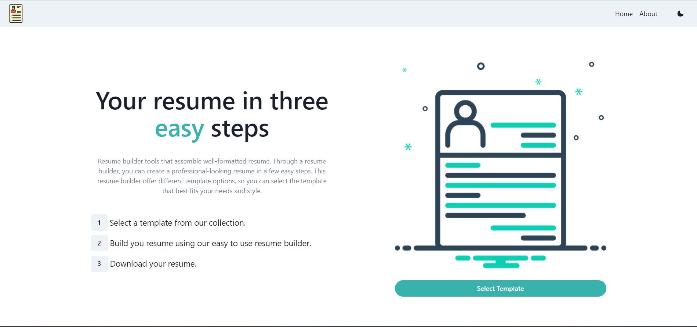
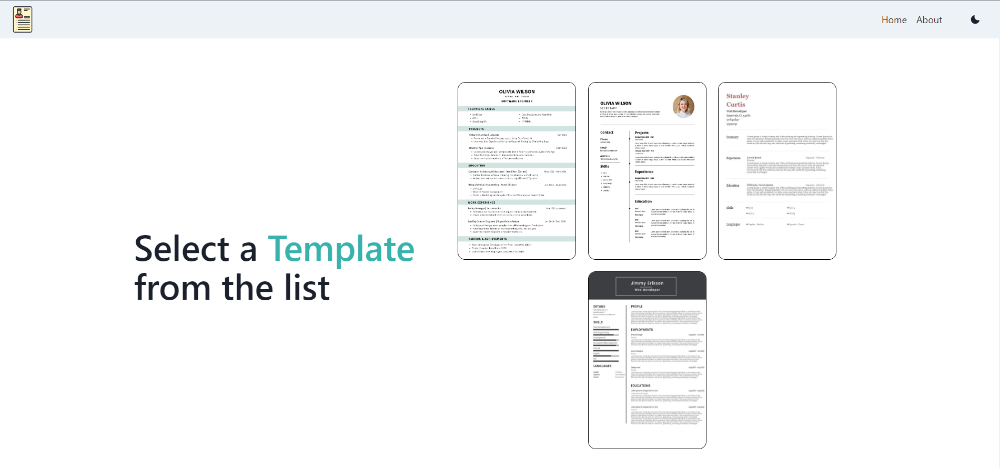
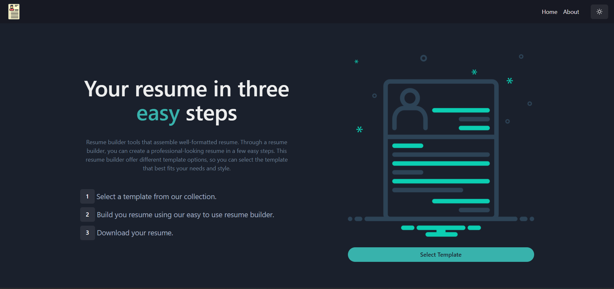

# Professional Resume Creator

Welcome to the Professional Resume Creator! Our platform makes it easy for users to design professional, customized resumes.

## Features

- **Intuitive Interface:** Create and edit resumes effortlessly with our user-friendly design.
- **Variety of Templates:** Select from multiple templates suited for different industries.
- **PDF Export:** Download your finished resume as a PDF for convenient sharing.
- **Dark Mode:** Enable dark mode for a more comfortable viewing experience.
- **Profile Picture Upload:** Include a profile picture on your resume.

## Screenshots

Check out some screenshots to see our website's features and functionality:

### Home Page


### Template Selection Page


### Dark Mode


## Getting Started

Follow these steps to set up the project on your local machine:

1. Clone this repository:
    ```bash
    git clone https://github.com/SubhangiSati/Professional-Resume-Creator.git
    ```

2. Navigate to the project directory:
    ```bash
    cd resume-builder
    ```

3. Install the required dependencies:
    ```bash
    npm install
    ```

4. Start the application:
    ```bash
    npm run start
    ```

5. Open [http://localhost:3000](http://localhost:3000) in your web browser to view the application.

### Built With

- [React](https://reactjs.org/)
- [Bootstrap](https://getbootstrap.com/)
- [Chakra UI](https://chakra-ui.com/)
- [React Router](https://reactrouter.com/)
- [React Icons](https://react-icons.github.io/react-icons/)
- [React HTML to PDF](https://www.npmjs.com/package/react-html-to-pdf)

### Authors

- [Subhangi Sati](https://github.com/SubhangiSati)


### License

This project is licensed under the MIT License. See the [LICENSE](LICENSE) file for more details.

